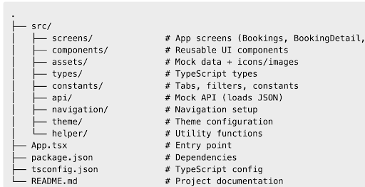
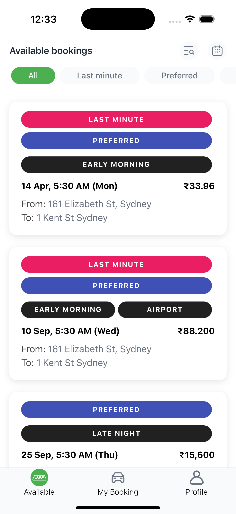
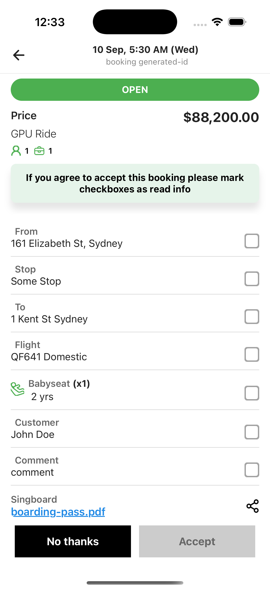
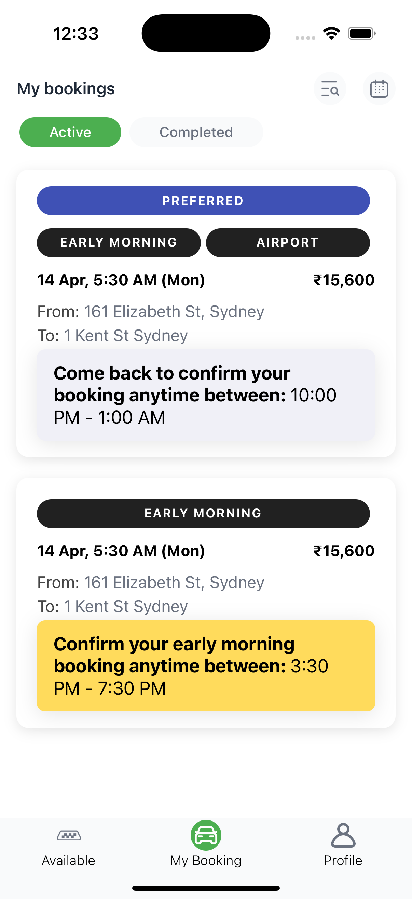

**Booking App (React Native)**
🐱‍👤 Overview
This project implements several booking-related pages based on the new Figma designs. The goal is to demonstrate the ability to:

Translate UI/UX designs into working React Native screens.

Write clean, maintainable, and reusable code.

Use mock data to simulate booking workflows.

No backend integration is included — the app uses mock booking data (JSON).

✓ Client Requirements Checklist

 UI Implementation → Booking list, booking detail, and my bookings screens implemented. 
 
 Mock data → Stored in assets/bookings.json.
 
 Technology → React Native (latest) with TypeScript.
 
 Code structure → Organized into screens/, components/, assets/, types/, etc.
 
 Reusable components → BookingCard, FilterTabs, BookingHeader, etc.
 
 No backend integration → Uses mock data only.
 
 Scalable design → Reusable and modular structure.

✓ Tech Stack

React Native (TypeScript)
React Navigation (basic navigation)
Mock JSON data (for bookings)
Custom theme (centralized in theme/)

✓ Findings from src/
Booking screens implemented
BookingsScreen.tsx
BookingDetailScreen.tsx
MyBooking.tsx

**Reusable booking components**
BookingCard.tsx
BookingHeader.tsx
BookingActionButtons.tsx
FilterTabs.tsx
ScreenHeader.tsx

**Mock data present**
_assets/bookings.json (sample booking data).
api/bookingsApi.ts (likely consuming mock data)._

**Supporting structure**
_types/booking.ts → Type definitions for bookings.
constants/bookingtabs.ts & filtertabs.ts → Config-driven UI.
theme/ → Centralized theme styling.
navigation/RootNavigator.tsx → Handles navigation between screens._

✓ Matches client requirements

UI implementation: Booking pages & detail screens exist.

Mock data: Provided (bookings.json).

Technology: React Native + TypeScript.

Code structure: Cleanly organized into screens/, components/, assets/, types/, etc.

Reusability: Booking card, filter tabs, and headers are reusable.

No backend integration: Uses mock data only.

📂 Folder Structure

💻 Getting Started
**1. Clone the repo**
_git clone <your-repo-url>
cd <project-folder>_

**2. Install dependencies**
_npm install
# or
yarn install_

**3. Run the app**
_For iOS:
pod-install
npm run ios_

For Android:
npm run android

📱 Screenshots
(Add your screenshots inside a new screenshots/ folder and update the paths below)

Bookings Screen

Booking Detail

My Bookings

🔑 Notes & Assumptions

Only core booking screens were implemented (not every booking status).
Navigation flow kept minimal enough to demonstrate screen linking.
Mock data is used to simulate API responses.
Some design assumptions were made where Figma details were ambiguous.
